  

## Hi, I'm Bruno Hjorth 👋

I'm studying Information Technology Engineering at KTH in Sweden. I like building technology that connects software to the physical world, especially robotics, embedded systems, and home automation.

### Selected projects

- **[MowgliNext](https://github.com/mowglinext/mowglinext)**: I'm a collaborator on the upstream MowgliNext project, contributing to an RTK based autonomous mower.
- **[Lugn](https://github.com/liltaket/lugn)**: My home automation project is still in development and currently runs my room on autopilot.
- **[Mowgli LoRa Link](https://github.com/liltaket/mowgli-lora-link)**: A LoRa modem and communication protocol for Mowgli robotics.

Outside my studies, I compete in FPV drone racing in Sweden and help organize events around the sport.
